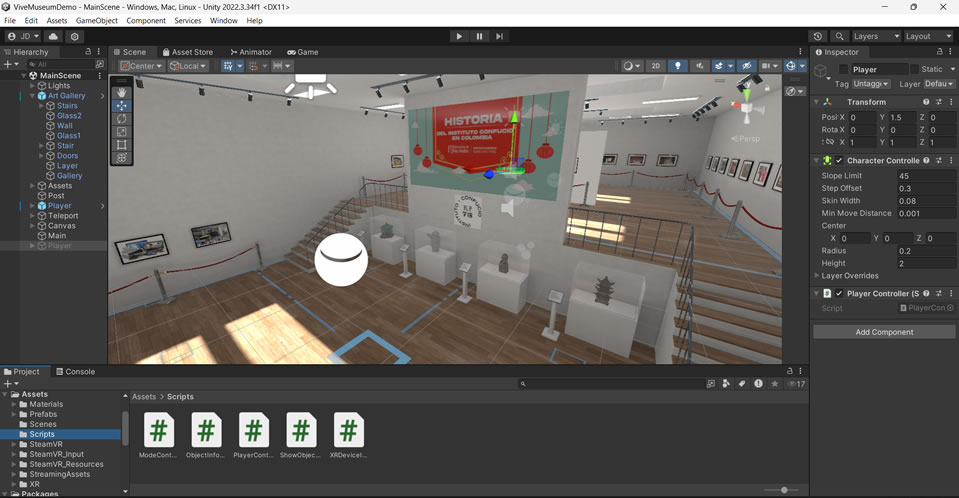
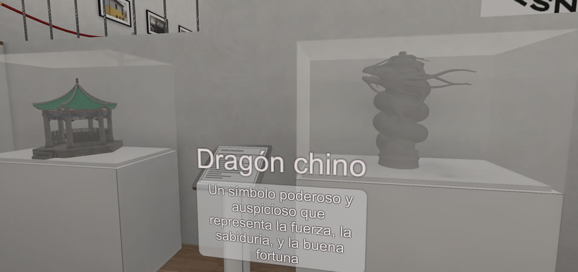

# ViveMuseumDemo - Museo Confucio

ViveMuseumDemo is a simple VR demo of a museum created to celebrate the 15th anniversary of the Confucio Institute at the University of the Andes, Bogota, Colombia. Users can move and interact in the environment as if they were in an actual museum. Each room features different photos depicting the history of the institute and other images related to Chinese culture. There is also a curated collection of artifacts and historical objects. By simply approaching and gazing at an object, detailed information about them appears. The application also implements a navigation technique based on teleporting interaction, where users only need to point to the floor at the intended spot, and the player is immediately teleported. This demo is a good starting point to develop more elaborate interactive VR museums that offer a rich, immersive experience blending education with beauty or tradition.

## Requirements

1. Unity3D version 2022 or later.

2. An HMD compatible with the SteamVR SDK and the XR plugin. This demo was developed using an HTC Vive Pro v2, but it has not been tested with other devices.

3. Nvidia GTX 1060 or later / AMD Radeon RX 480 or later

## Getting Started 

1. Download and install your HMD drivers from the provider. For the HTC Vive Pro, follow the guide in the following link: https://www.vive.com/us/setup/vive-pro-hmd/.

2. Download and install SteamVR: https://store.steampowered.com/app/250820/SteamVR.

3. Connect the HMD to your PC, perform the device calibration, and complete the room setup process using SteamVR.

4. Download the project code, open the scene 'MainScene.scene' in Unity, and press play. You'll see the museum in your headset.

5. To move in the environment, point to the floor and press the trigger; you will be immediately teleported to the location. To move to the second floor, point above the stairs.

6. To get information about an item, simply approach and gaze at the object; a dialog will appear with useful information about it.

7. That's all! I hope you enjoy it! 

## Credits

Developed by Jose L. Dorado (jl.dorado59@uniandes.edu.co,  jl-dorado@hotmail.com). 
Copyright 2022 © Grupo Imagine Uniandes
https://imagine.uniandes.edu.co